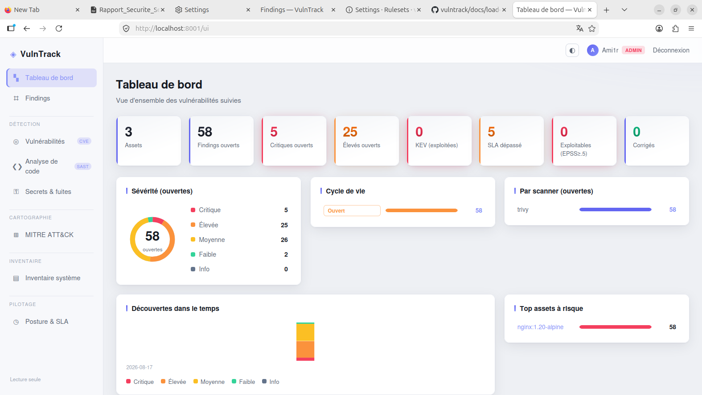
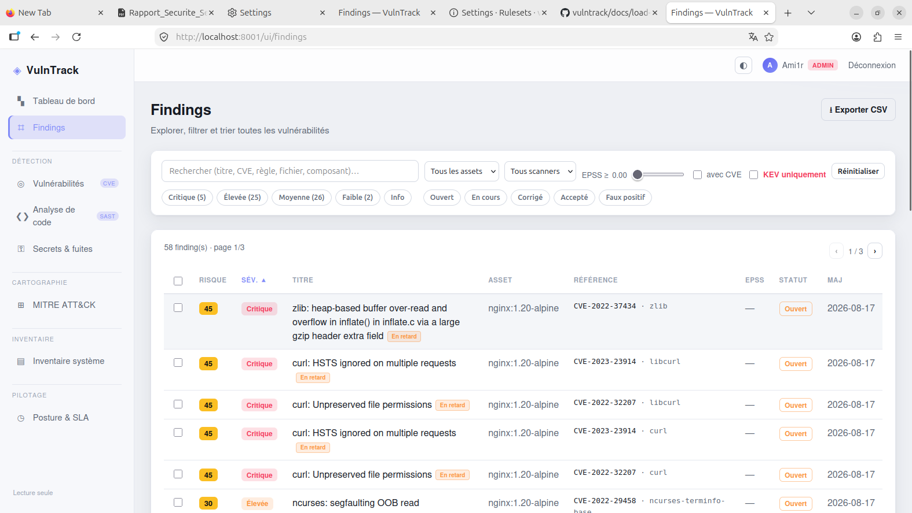
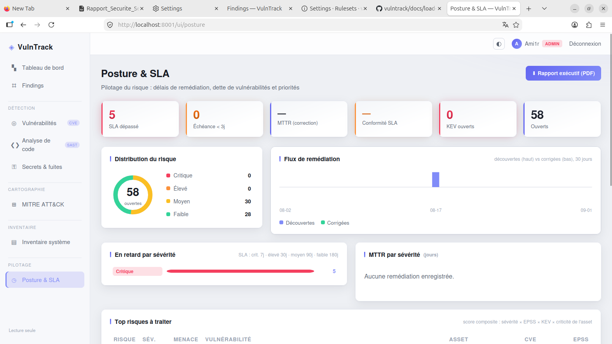
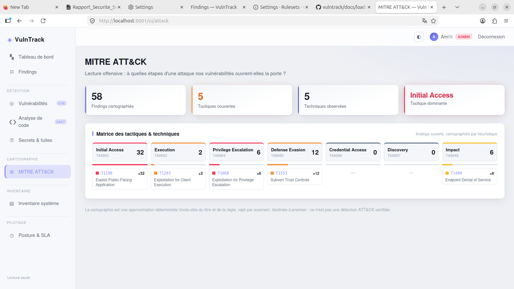
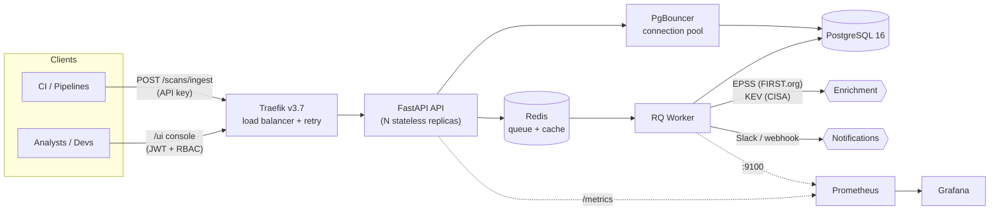
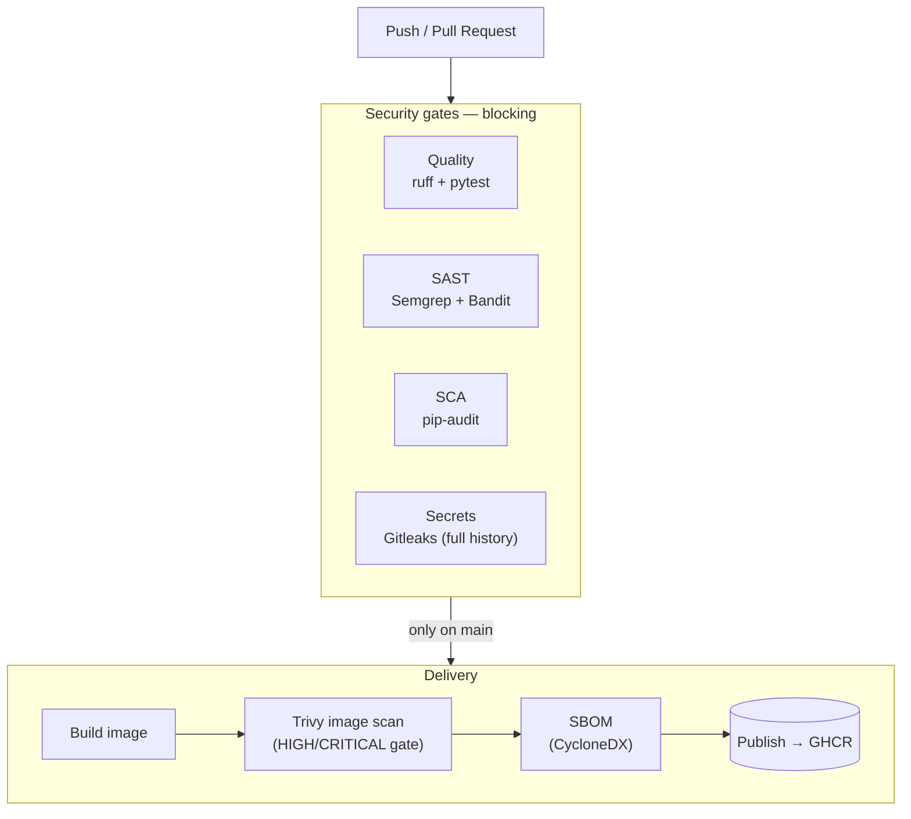

<div align="center">

# 🛡️ VulnTrack

**Risk-Based Vulnerability Management — multi-scanner ingestion, EPSS/KEV enrichment, a full triage console, and a security-gated CI/CD pipeline that ships a signed, scanned image.**

**Gestion des vulnérabilités basée sur le risque — ingestion multi-scanner, enrichissement EPSS/KEV, console de triage complète, et pipeline CI/CD sécurisé qui livre une image scannée et publiée.**

[](https://github.com/x0u7s1d3r/vulntrack/actions/workflows/ci-security.yml)
[](#-license--licence)


[](https://github.com/x0u7s1d3r/vulntrack/pkgs/container/vulntrack)

**[🇬🇧 English](#-english) · [🇫🇷 Français](#-français)**

</div>

---

## 📸 Aperçu / Screenshots

<div align="center">

| Tableau de bord / Dashboard | Workspace Findings |
| :---: | :---: |
|  |  |
| **Posture & SLA (RBVM)** | **MITRE ATT&CK** |
|  |  |

</div>

---

## 🏗️ Architecture



VulnTrack is a **stateless FastAPI service** behind Traefik, backed by PostgreSQL and Redis. Scan reports are ingested through a message queue and processed asynchronously by an RQ worker, which enriches findings with **EPSS** (real-world exploitation probability) and **KEV** (CISA Known Exploited Vulnerabilities), then computes a risk score. The whole stack runs on Docker Compose and is fully observable via Prometheus + Grafana.

---

## 🔒 CI/CD Security Pipeline

Every push and pull request runs a **shift-left security pipeline** as a blocking gate. A pull request cannot be merged into `main` unless all four gates are green (enforced by a branch protection ruleset). On merge to `main`, the delivery stage builds, scans, inventories, and publishes the image.



| Stage | Tool | What it catches |
| --- | --- | --- |
| **Quality** | ruff + pytest | Lint errors, failing tests |
| **SAST** | Semgrep + Bandit | Insecure code patterns |
| **SCA** | pip-audit | Vulnerable Python dependencies |
| **Secrets** | Gitleaks | Hard-coded credentials (scans full git history) |
| **Delivery** | Trivy + CycloneDX | Vulnerable OS/lib layers in the final image, full SBOM, publish to GHCR |

---

## 🇬🇧 English

### The problem

Scanning is easy. Acting on the results is not. Every pipeline run republishes the same thousands of lines of JSON; three scanners report the same CVE in three different shapes. Without consolidation, the noise buries the vulnerabilities that actually matter — and nothing gets fixed.

VulnTrack turns that raw stream into **unique, prioritized, time-tracked findings**, and adds a **risk-based** layer on top so you always know what to fix first.

### Key features

- **Multi-scanner ingestion** — Trivy (SCA/images), Semgrep (SAST), Gitleaks (secrets), deduplicated by a scanner-scoped SHA-256 fingerprint so continuous rescans never create duplicates.
- **Risk-Based Vulnerability Management (RBVM)** — a composite risk score (severity × EPSS × KEV × asset criticality, 0–100 with bands), editable business criticality per asset, SLA policy and **MTTR** computed from the audit trail, and a **Posture & SLA** page (risk distribution, remediation burndown, overdue tracking).
- **Triage console** (`/ui`) — dashboard, a full findings workspace with combinable filters, faceted search, bulk actions and CSV export, status lifecycle with **audited** justifications, plus five Wazuh-style modules: Vulnerability Detection (CVE/EPSS), SAST, Secrets, **MITRE ATT&CK** mapping, and System Inventory.
- **Enrichment** — EPSS (FIRST.org) and KEV (CISA) so prioritization reflects real-world exploitation, not just CVSS.
- **Executive PDF report** — one-click risk posture summary (ReportLab).
- **Production-grade platform** — high availability (Traefik load balancing + retry, stateless replicas, PgBouncer), observability (Prometheus RED + business metrics, provisioned Grafana), Slack/webhook notifications, scripted backup & restore.
- **Security by design** — HttpOnly session cookie, double-submit CSRF, server-side RBAC (admin/analyst/viewer), strict CSP, anti-XSS rendering via `textContent`, non-root container.

### Quickstart

```bash
git clone https://github.com/x0u7s1d3r/vulntrack.git
cd vulntrack
cp .env.example .env

docker compose up -d

docker compose exec api python -m scripts.create_admin --username amiir --password "a-strong-password"
```

Then open:

- **Console** → http://localhost:8001/ui
- **API docs (Swagger)** → http://localhost:8001/docs
- **Grafana** → http://localhost:3001

Pull the published image directly:

```bash
docker pull ghcr.io/x0u7s1d3r/vulntrack:latest
```

### Tech stack

| Domain | Technologies |
| --- | --- |
| API | Python 3.12, FastAPI, SQLAlchemy, Pydantic, Alembic |
| Data | PostgreSQL 16, Redis, RQ (worker) |
| Enrichment | EPSS (FIRST.org), KEV (CISA) |
| Frontend | Server-rendered shells + vanilla JS (no external CDN), strict CSP |
| Containers | Docker, Docker Compose, multi-stage hardened image (non-root) |
| Load balancing / HA | Traefik v3.7, PgBouncer |
| Observability | Prometheus (multiprocess), Grafana |
| CI/CD | GitHub Actions — ruff, pytest, Semgrep, Bandit, pip-audit, Gitleaks, Trivy, CycloneDX SBOM, GHCR |
| Load testing | k6 |

### Roadmap

- [x] API skeleton, data model, hardened image
- [x] Async worker + message queue, cache, connection pool, graceful shutdown
- [x] RBAC accounts, multi-scanner ingestion, EPSS score
- [x] HA (Traefik + replicas + retry), Prometheus/Grafana observability
- [x] Slack/webhook notifications, scripted backup & restore
- [x] Web triage console + Wazuh-style modules
- [x] RBVM: risk score, KEV, SLA/MTTR, posture burndown, executive PDF
- [x] CI/CD security pipeline (SAST/SCA/secrets gates + branch protection)
- [x] Delivery: image scan (Trivy), SBOM (CycloneDX), publish to GHCR
- [ ] Kubernetes / Helm chart
- [ ] Dynamic analysis (DAST) in the nightly pipeline

---

## 🇫🇷 Français

### Le problème

Scanner est facile. Exploiter les résultats ne l'est pas. Chaque exécution de pipeline republie les mêmes milliers de lignes de JSON ; trois scanners remontent la même CVE sous trois formats différents. Sans consolidation, le bruit noie les vulnérabilités qui comptent vraiment — et personne ne corrige rien.

VulnTrack transforme ce flux brut en **findings uniques, priorisés et suivis dans le temps**, et ajoute une couche **basée sur le risque** pour toujours savoir quoi corriger en premier.

### Fonctionnalités clés

- **Ingestion multi-scanner** — Trivy (SCA/images), Semgrep (SAST), Gitleaks (secrets), dédupliqués par une empreinte SHA-256 scopée par scanner : rescanner en continu ne crée jamais de doublons.
- **Gestion basée sur le risque (RBVM)** — score de risque composite (sévérité × EPSS × KEV × criticité de l'asset, 0–100 avec bandes), criticité métier éditable par asset, politique **SLA** et **MTTR** calculés depuis l'audit trail, et une page **Posture & SLA** (distribution du risque, burndown de remédiation, suivi des retards).
- **Console de triage** (`/ui`) — tableau de bord, workspace de findings avec filtres combinables, recherche à facettes, actions en masse et export CSV, cycle de vie des statuts avec justifications **historisées**, plus cinq modules façon Wazuh : Détection de vulnérabilités (CVE/EPSS), SAST, Secrets, cartographie **MITRE ATT&CK**, et Inventaire système.
- **Enrichissement** — EPSS (FIRST.org) et KEV (CISA) : la priorisation reflète l'exploitation réelle, pas seulement le CVSS.
- **Rapport exécutif PDF** — résumé de la posture de risque en un clic (ReportLab).
- **Plateforme de niveau production** — haute disponibilité (Traefik + retry, réplicas sans état, PgBouncer), observabilité (Prometheus RED + métriques métier, Grafana provisionné), notifications Slack/webhook, sauvegarde & restauration scriptées.
- **Sécurité par conception** — cookie de session HttpOnly, CSRF double-submit, RBAC côté serveur (admin/analyst/viewer), CSP stricte, rendu anti-XSS via `textContent`, conteneur non-root.

### Démarrage rapide

```bash
git clone https://github.com/x0u7s1d3r/vulntrack.git
cd vulntrack
cp .env.example .env

docker compose up -d

docker compose exec api python -m scripts.create_admin --username amiir --password "un-mot-de-passe-solide"
```

Puis ouvre :

- **Console** → http://localhost:8001/ui
- **Docs API (Swagger)** → http://localhost:8001/docs
- **Grafana** → http://localhost:3001

Tirer l'image publiée directement :

```bash
docker pull ghcr.io/x0u7s1d3r/vulntrack:latest
```

### Stack technique

| Domaine | Technologies |
| --- | --- |
| API | Python 3.12, FastAPI, SQLAlchemy, Pydantic, Alembic |
| Données | PostgreSQL 16, Redis, RQ (worker) |
| Enrichissement | EPSS (FIRST.org), KEV (CISA) |
| Frontend | Coquilles rendues serveur + JS vanilla (aucun CDN externe), CSP stricte |
| Conteneurs | Docker, Docker Compose, image multi-stage durcie (non-root) |
| Répartition / HA | Traefik v3.7, PgBouncer |
| Observabilité | Prometheus (multiprocess), Grafana |
| CI/CD | GitHub Actions — ruff, pytest, Semgrep, Bandit, pip-audit, Gitleaks, Trivy, SBOM CycloneDX, GHCR |
| Tests de charge | k6 |

### Feuille de route

- [x] Squelette de l'API, modèle de données, image durcie
- [x] Worker asynchrone + file de messages, cache, pool de connexions, arrêt gracieux
- [x] Comptes RBAC, ingestion multi-scanner, score EPSS
- [x] HA (Traefik + réplicas + retry), observabilité Prometheus/Grafana
- [x] Notifications Slack/webhook, sauvegarde & restauration scriptées
- [x] Console web de triage + modules façon Wazuh
- [x] RBVM : score de risque, KEV, SLA/MTTR, burndown de posture, PDF exécutif
- [x] Pipeline CI/CD de sécurité (gates SAST/SCA/secrets + protection de branche)
- [x] Livraison : scan de l'image (Trivy), SBOM (CycloneDX), publication sur GHCR
- [ ] Chart Kubernetes / Helm
- [ ] Analyse dynamique (DAST) dans le pipeline nocturne

---

## 📄 License / Licence

[MIT](LICENSE) — © 2026 Amiir Touré.

VulnTrack is a portfolio project built step by step as a hands-on DevSecOps lab; it is also the target application protected by the companion **ARGUS** SOC/DevSecOps project. / VulnTrack est un projet de portfolio construit pas à pas comme un lab DevSecOps ; c'est aussi l'application cible protégée par le projet compagnon **ARGUS**.
